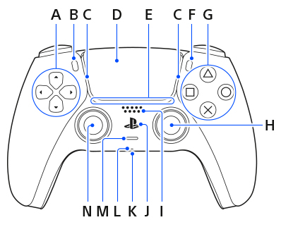
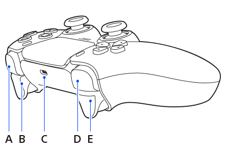

# Puppetstrings
*Johnny Matthews*

## Todo

## What's New
**Version 1.1.1**

* Add duplicate mapping button
* Add Show/Hide all mappings
* Play/Start Button Starts Anim if stopped. Toggles Record while playing
* Major revamp of value assignment code (more effecient)

**Version 1.1.0**

* Add Duplication Button Groups
* Add Star Icon next to button mapping for easier selection

**Version 1.0.11**

* Add Importing and Exporting Button Groups
* Object Selection has a picker

**Version 1.0.10**

* Add Input and Output Clipping
* Add Input Scaling and Rounding
* Try to clean up multiple timers causing slowdowns
* Show Connected Controller Name if Available

**Version 1.0.9**

* Add Ability to Change LED color
* Add Ability to Change Player # Display
* Turn Controller LED to red when recording
* Add Touch, Acceleratometer and Gyroscope Inputs
* Add +=, -=, and *= Assignment for especially with sensor data
* Only Retrieve Needed Data from Controller instead of all data points
* Add input scaling and rounding (rounding can help with gyro and acceleratometer data)

**Version 1.0.8**

* New Mapping curves start as (-1,-1) to (1,1)

**Version 1.0.7**

* Variable Keyframe Rates per mapping. KF Rate in mapping is override for global Keyframe Interval. Set to 0 to use global setting
* Code Cleanups
* More Error Checking

**Version 1.0.6**

* Add Ability to Rumble Controller
* Rumble on Punch-In or Punch-Out
* Rumble on Start Record

**Version 1.0.5**

* Posebone mappings will auto-mute now when recording.
* When recording over previous keyframes with a lower keyframe rate, the non-keyframe frames will have keyframes deleted.

---

## PS5 Controller Mapping

* A  D Pad Up / Down / Left / Right
* B  Back Button  (Stop Control)
* C  Light Bar   (Red Recording / Green Playing)
* D  Touch Pad
* E  Player Indicator
* F  Start Button   (Play Control)
* G  Directional Buttons (North, South, East, West)
* H  Right Stick
* I  Speaker
* J  Guide Button
* K  Headset Jack
* L  Microphone
* M  Mute (Misc 1 Button)
* N  Left Stick

* A  Right Shoulder
* B  Right Trigger
* C  Usb Port
* D  Left Shoulder
* E  Left Trigger

---

## Instructions

### Setup

1. Plug in Controller.
2. In the 3D Viewport **N panel**, press **Enable Controller** – it should say *Controller Running*.

### Controls

* **Start Button**: Start the play control.
* **Back Button**:

  * When Playing: stops playback.
  * When Stopped: goes to start frame.

### Recording

* **Arm recording without punch** → records at all times.
* **Punch recording**:

  * Create markers in the timeline and choose them for punch points (pre-roll optional).
  * When punch is enabled (click the *arm circle* next to punch in), it always records in the punch area.
  * When no punch points are selected, recording happens at all frames.

### Options

* **Prevent Looping Animation**: Playback cancels at the final frame instead of looping.
* **Auto-Simplify**: Toggles render settings "Simplify" panel during recording or playback.
* **Controller FPS**: How often the controller is polled.
* **Keyframe Interval**: How often to record keyframes.
* **Smoothing (ms)**: Time window for smoothing axis & trigger controls.
* **Debounce Time (ms)**: Delay to prevent jittery button presses.

### Mappings

* **Mapping Set**: Group of key mappings. Needs at least one. If unchecked, the set has no effect.
* **Button Mappings**: Specific key mappings. If unchecked, the mapping has no effect.

  * **Checkbox**: Enable this mapping for processing.
  * **Eye**: Show or hide mapping details.
  * **Button**: Axis or Button to map to.
  * **Object**: Object to apply mapping.
  * **Mapping Type**:

    * *Location / Rotation / Scale*: Axis to map is offered.
    * *Shape Key*: Lists available shape keys.
    * *Modifier / Data Path*: Still in development.
  * **Operation**:

    * *Direct Value*: Use value directly from controller.
    * *Curve*: Map controller value to a curve (extend with curve tools).
    * *Inverted Button*: 0 = On, 1 = Off.
    * *Inverted Axis*: Flips -1 to 1 → 1 to -1.
    * *Assignment Expression*: Write expression with `value` (start with `=`).

      * Example: `= value * 2`
    * *Easing*: Apply easing method at controller level before returning to script.

---

## TODO

* Make a way to set smoothing per button.